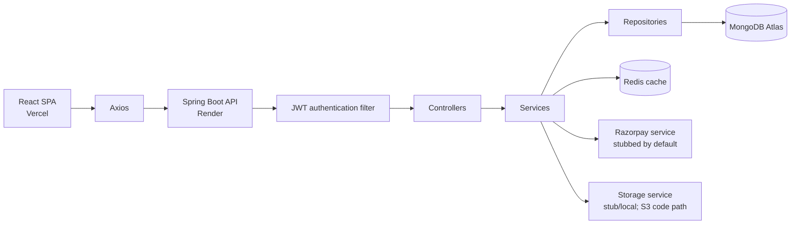
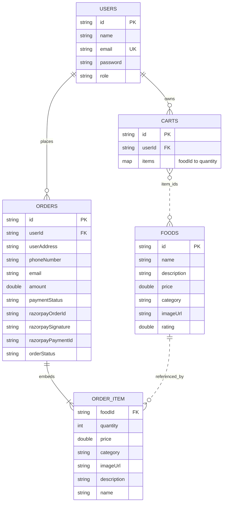

<a href="https://github.com/Pratham-131/Happy-Plates-/actions/workflows/ci.yml"></a>

# Happy Plates — Full-Stack Food Ordering Platform

A full-stack food ordering application with a React (Vite) frontend and a Spring Boot REST API backed by MongoDB.

**Live:** [happy-plates.vercel.app](https://happy-plates.vercel.app) · **Backend API:** [happy-plates-backend.onrender.com](https://happy-plates-backend.onrender.com)

> The backend runs on Render's free tier and may take 30–60 seconds to wake up on the first request.

## What This Project Does

Users can register and log in, browse food items, manage a cart, and place orders. Admin accounts can add, update, and delete food items and view or update order status. The frontend is a React SPA that calls the backend REST API.

## Tech Stack

**Backend:** Java 17, Spring Boot, Spring Security, JWT, Maven, JUnit 5

**Data and cache:** MongoDB documents; Redis-backed Spring Cache

**Frontend:** React, Vite, Axios; deployed on Vercel

**Infrastructure:** Docker Compose, GitHub Actions CI, backend deployed as a Docker container on Render

**Integration status:** Razorpay and durable object storage are not fully integrated in the deployed app. Payment order creation and storage have configurable stub/local/AWS code paths; see [Feature Flags](#feature-flags) and [Limitations](#limitations).

## Architecture



- **Frontend:** React pages and services send HTTP requests through Axios to the API.
- **API and security:** Spring Security applies the JWT filter before requests reach controllers; public and role-protected routes are configured centrally.
- **Business and persistence:** Controllers delegate to services, which use MongoDB repositories; food reads also use Redis-backed Spring Cache.
- **External integrations:** Payment verification uses a stub or validates the Razorpay signature, based on configuration; local uploads are not durable on ephemeral hosts.

## Database Schema

The document types below match the MongoDB entities. `ORDER_ITEM` is embedded in an order rather than stored in its own collection. `CartEntity.items` is a map from food ID to quantity; the ID relationships are application-level references, not MongoDB-enforced foreign keys.



## API Endpoints

All paths are relative to the API host. Protected endpoints accept any authenticated account unless marked `ADMIN`; the general security rule does not restrict them to only the `USER` role.

| Method | Path | Auth | Description | Success status |
| --- | --- | --- | --- | --- |
| POST | `/api/register` | Public | Register an account | 201 Created |
| POST | `/api/login` | Public | Log in a non-admin account and issue a JWT | 200 OK |
| POST | `/api/admin/login` | Public | Log in an admin account and issue a JWT | 200 OK |
| GET | `/images/**` | Public | Serve static images from the backend resources | 200 OK |
| GET | `/uploads/**` | Public | Serve uploaded files from the configured upload directory | 200 OK |
| GET | `/api/foods` | Public | List foods | 200 OK |
| GET | `/api/foods/{id}` | Public | Read one food item | 200 OK |
| POST | `/api/foods` | ADMIN | Add a food item and image | 200 OK |
| PUT | `/api/foods/{id}` | ADMIN | Update a food item and optional image | 200 OK |
| DELETE | `/api/foods/{id}` | ADMIN | Delete a food item | 204 No Content |
| POST | `/api/cart` | USER/ADMIN | Add one quantity of a food item to the current user's cart | 200 OK |
| GET | `/api/cart` | USER/ADMIN | Read the current user's cart | 200 OK |
| DELETE | `/api/cart` | USER/ADMIN | Clear the current user's cart | 204 No Content |
| POST | `/api/cart/remove` | USER/ADMIN | Remove one quantity of a food item | 200 OK |
| POST | `/api/orders/create` | USER/ADMIN | Create an order and payment order | 200 OK |
| POST | `/api/orders/verify` | USER/ADMIN | Stub verification or Razorpay signature validation, based on configuration | 200 OK |
| GET | `/api/orders` | USER/ADMIN | List the current user's orders | 200 OK |
| GET | `/api/orders/all` | ADMIN | List all orders | 200 OK |
| PATCH | `/api/orders/status/{orderId}?status={status}` | ADMIN | Update an order's status | 200 OK |

## Authentication Flow

Registration encodes the submitted password with BCrypt before saving the user. Registration always assigns the USER role and ignores any role sent by the client. Admin accounts are created separately. `/api/login` authenticates a non-admin account; `/api/admin/login` authenticates an admin account. Successful login creates an HS256 JWT with the email as subject and role as a claim; it expires after 10 hours. Clients send it as `Authorization: Bearer <token>`. `JwtAuthenticationFilter` extracts the email, reloads the user, and validates the token before establishing the Spring Security context. Food reads and account login/register are public, food mutations and admin-order routes require `ADMIN`, and other protected routes require authentication.

```mermaid
sequenceDiagram
    actor Client
    participant API as Spring Boot API
    participant Users as UserService / UserRepository
    participant Auth as AuthenticationManager / JwtUtil
    participant Filter as JwtAuthenticationFilter
    Client->>API: POST /api/register (name, email, password)
    API->>Users: BCrypt-encode password and save user
    Client->>API: POST /api/login or /api/admin/login
    API->>Auth: Authenticate credentials; check USER vs ADMIN route
    Auth-->>Client: JWT (HS256, 10-hour expiry) on success
    Client->>API: Protected request + Bearer token
    API->>Filter: Extract subject; load account; validate JWT
    Filter-->>API: Set authenticated user and authorities
    API-->>Client: Continue if route permits that account
```

## Caching with Redis

Spring Cache stores only food read results: the full food list in cache `foods`, and individual `FoodResponse` values in cache `food` keyed by food ID. `RedisConfig` sets a 10-minute TTL for both caches and disables caching null values. Adding food evicts all `foods` entries; updating or deleting food evicts all entries from both `foods` and `food`. Cart, user, and order data are not annotated as cached.

## How to Run

### Prerequisites

- JDK 17+
- Node.js and npm
- MongoDB and Redis, locally or reachable services
- `JWT_SECRET` set for the backend

### Backend

```bash
cd foodiesapi
./mvnw spring-boot:run
```

On Windows, run `.\mvnw.cmd spring-boot:run` from PowerShell. The API listens on `http://localhost:8081`. The default application properties point MongoDB and Redis at localhost.

### Frontend

```bash
cd foodies
npm install
npm run dev
```

Vite serves the app at `http://localhost:5173`. Set `VITE_API_URL` to the backend origin (for example, `http://localhost:8081`) before running or building the frontend.

### Docker

```bash
docker-compose up --build
```

Compose starts four containers: MongoDB 7, Redis 7, the Spring Boot API, and the frontend served by Nginx. In this Compose setup the database is the local MongoDB container at `mongo:27017/foodiesdb`, not Atlas; it persists in the `mongo-data` volume. Redis is the local `redis` container. The API is exposed on port 8081 and the frontend on port 3000. Compose passes `JWT_SECRET` to the API; provide a non-empty signing secret for JWT use. The deployed backend's MongoDB Atlas configuration is separate from this local Compose setup.

## Feature Flags

The properties are in `foodiesapi/src/main/resources/application.properties`.

- `app.stub.payment=true` makes `OrderServiceImpl` assign a synthetic `stub_order_...` ID and mark payment `PENDING`; verification then marks the matching order `PAID_STUB` and returns a stub-verification message. With it set to `false`, `OrderServiceImpl` calls the Razorpay Java client to create a payment order, and verification validates the Razorpay HMAC SHA256 signature, rejecting invalid signatures with HTTP 400.
- `app.stub.storage=true` makes `FoodServiceImpl` return a synthetic `https://stub-bucket.local/...` image URL and treats file deletion as successful without accessing storage. With it set to `false`, `app.storage.type=local` (the current property value) writes uploads to `app.upload.dir` and serves their URL under `/uploads/`; a non-`local` storage type follows the S3 calls in `FoodServiceImpl`, using the `S3Client` configured by `AWSConfig`.

These options select code paths; they do not provision credentials or make the deployed integrations durable. In particular, local uploads can be lost when an ephemeral deployment is replaced.

## Environment Variables

Examples below are placeholders, not credentials. Spring Boot maps environment overrides to the matching application properties; Compose explicitly supplies the MongoDB URI and Redis host to the API.

| Name | Purpose | Example placeholder |
| --- | --- | --- |
| `JWT_SECRET` | Signing key required by `jwt.secret.key` | `<replace-with-a-long-random-secret>` |
| `REDIS_HOST` | Redis hostname; defaults to `localhost` | `localhost` |
| `SPRING_DATA_MONGODB_URI` | MongoDB connection URI; Compose uses its MongoDB service | `mongodb://localhost:27017/foodiesdb` |
| `VITE_API_URL` | API origin used by the frontend Axios services | `http://localhost:8081` |

## Testing

There are 28 JUnit test methods across the backend test sources: 21 service-layer tests (10 `FoodServiceImplTest`, 10 `OrderServiceImplTest`, 1 `UserServiceImplTest`) and 7 controller-layer tests (`OrderControllerTest`). No repository, authentication-controller, or frontend test classes are present in the test tree.

Run the backend tests from the repository root:

```bash
cd foodiesapi
./mvnw test
```

On Windows, use `.\mvnw.cmd test`. GitHub Actions also runs `mvn -B test` for the backend and `npm ci` followed by `npm run build` for the frontend.

## Current Status

- The code includes account registration/login, public food browsing, cart operations, order creation/listing, and admin food/order operations.
- CI builds the backend and runs its tests, then installs frontend dependencies and builds the Vite app.
- The README's live links point to the Vercel frontend and Render backend; the backend may have a free-tier cold start.
- Razorpay order creation is configurable; stub verification marks orders `PAID_STUB`, while live mode validates the payment signature. Webhook processing is not implemented. Storage defaults to local disk rather than durable cloud storage.
- Docker Compose is a local stack with MongoDB and Redis containers; the deployed database/cache configuration is independent of Compose.

## Design Decisions

- **MongoDB:** Users, foods, carts, and orders are already modeled as documents; ordered items are embedded in each order, while cart quantities are stored as a food-ID map.
- **JWT:** Spring Security is configured statelessly and uses JWT bearer authentication, so requests carry identity without server-side HTTP sessions.
- **Redis:** Food-list and food-detail reads are cached for 10 minutes to avoid repeating database reads between food mutations.
- **Feature-flagged stubs:** Payment and storage code paths can be exercised without requiring a working external account for every local run; the flags make the selected behavior explicit, but do not replace production integration and verification work.

## Limitations

- With `app.stub.payment=true`, `/api/orders/verify` marks the matching order `PAID_STUB` and identifies the response as stub verification. With the flag disabled, the API validates the Razorpay HMAC SHA256 signature and rejects invalid signatures with HTTP 400; webhook processing is not implemented.
- The configured storage type is local disk. The AWS S3 code path exists, but the repository does not provide deployable credentials; local uploads on ephemeral hosts do not persist across redeploys.
- The local Docker Compose database is MongoDB, not MongoDB Atlas. Atlas is used only when the deployed environment is configured with an Atlas connection URI.
- The backend test suite covers food, order, and registration services plus the order controller. Authentication-controller, repository-integration, and frontend behavior have no tests in the checked-in test tree.

## Planned / In Progress

- [ ] Implement Razorpay webhook handling for payment/order status updates.
- [ ] Configure durable S3/Cloudinary storage for admin-uploaded images.
- [ ] Add circuit-breaker/resilience patterns for external service calls.

## License

For learning and portfolio purposes.